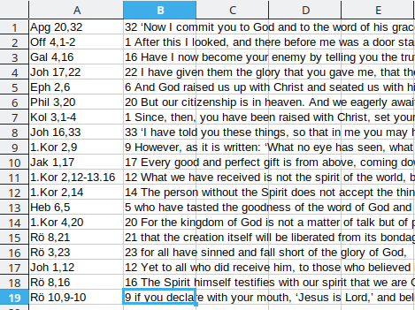
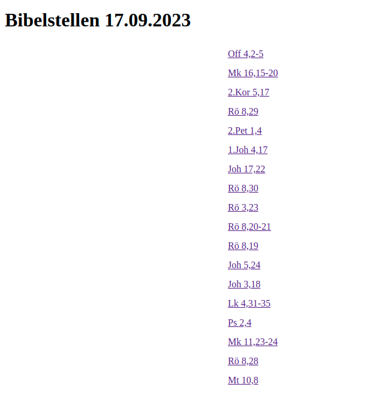

# Bibelstellen

Die Bibelstellen lassen sich so anzeigen, dass man auf die jeweilige Stelle klicken muss und diese dann angezeigt wird.
Das wird mit mehreren verlinkten HTML Dateien erreicht (dieselben Dateien, die Webseiten im Internet darstellen).

Um das umzusetzen habe ich ein Skript geschrieben, dass eine Excel- bzw. CSV-Datei ausliest und daraus diese HTML Dateien erstellt. Im Anschluss 
können sie hier hochgeladen und über einen Browser auf Handy oder PC angezeigt werden.

## Excel Datei

Die Excel Datei muss dabei die folgende Form bleiben: In Spalte A die Bezeichnung der Schriftstelle eintragen (z.B. Joh 3:16). In Spalte B wird dann der Vers in Englisch eingetragen (also z.B. "16 For God so loved the world that he gave his one and only Son, that whoever believes in him shall not perish but have eternal life.").
Auch längere Versabschnitte können problemlos in eine Zelle kopiert werden.

Das kann dann in etwa so aussehen:



Diese Datei könnt ihr dann mir zuschicken und ich führe das Skript aus, lade die Dateien hoch und sende euch den Link zu. 
Dieser wird meistens die folgende Form haben:

```
https://josuagoecking.github.com/uebersetzung/<YYYY>-<MM>-<DD>/
```

mit dem Jahr `<YYYY>`, dem Monat `<MM>` und Tag `<DD>`.

## Ergebnis

Öffnet man diese Seite erhält man als Ergebnis eine Übersicht wie z.B. diese:



Klickt man auf eine der Bibelstellen wird man zum Vers weitergeleitet:


Klickt man dort auf "Back" gelangt man zurück zur Übersicht.
